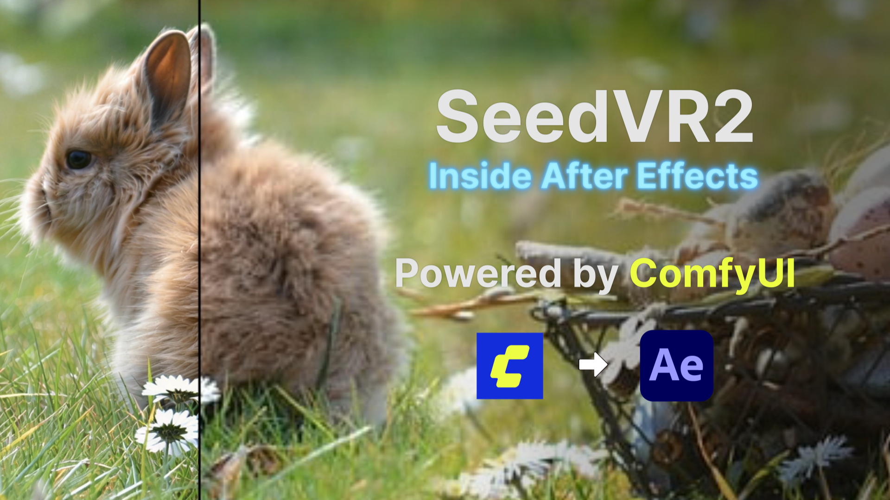
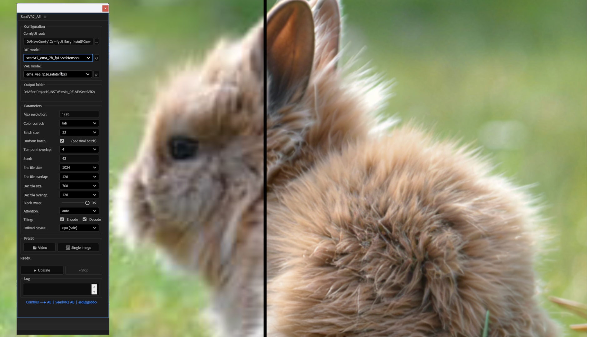

# SeedVR2 for After Effects

**Run SeedVR2 AI upscaling directly inside After Effects — no switching apps, no manual exporting.**

Select a layer, click Upscale, get a high-quality result back in your timeline. Works on single images and PNG sequences. Uses the same pipeline as the [ComfyUI-SeedVR2_VideoUpscaler](https://github.com/numz/ComfyUI-SeedVR2_VideoUpscaler) node by numz & AInVFX.





---

## Features

- ✅ One-click AI upscaling from inside After Effects
- ✅ GPU accelerated with BlockSwap — runs on 12-16GB VRAM
- ✅ Supports single images and PNG sequences
- ✅ Same 4-phase pipeline as the ComfyUI node (encode → DiT → decode → post-process)
- ✅ Color correction (LAB, Wavelet, HSV, AdaIN)
- ✅ Video and Image presets for quick setup
- ✅ Stop button to cancel processing at any time
- ✅ Output auto-imported into the timeline

---

## Requirements

| Requirement | Notes |
|---|---|
| After Effects | CC 2019 or later |
| ComfyUI | Installed and working |
| ComfyUI-SeedVR2_VideoUpscaler | Custom node installed in ComfyUI |
| SeedVR2 models | Downloaded in `models/SEEDVR2/` |
| GPU (NVIDIA CUDA) | 12GB+ VRAM recommended |
| OS | Windows ✅ tested / macOS ⚠ not tested |

> **Note:** You do **not** need ComfyUI running. Only the installation is required — the script imports the node's Python code directly.

### Required Models

Download these via ComfyUI on first use, or manually place in `ComfyUI/models/SEEDVR2/`:

| Model | Size | Role |
|---|---|---|
| `seedvr2_ema_7b_fp16.safetensors` | ~14GB | DiT (main upscaler) |
| `ema_vae_fp16.safetensors` | ~800MB | VAE (encoder/decoder) |

FP8 and GGUF variants are also supported.

---

## Installation

### 1 — Install the ComfyUI node

```bash
cd ComfyUI/custom_nodes
git clone https://github.com/numz/ComfyUI-SeedVR2_VideoUpscaler.git
```

Then open ComfyUI once to let it download the models automatically, or download them manually.

### 2 — Copy the script files

You need only **two files**. Copy them to your After Effects Scripts folder:

**Windows:**
```
C:\Program Files\Adobe\Adobe After Effects <version>\Support Files\Scripts\
```

**File placement:**
```
Scripts/
├── ScriptUI Panels/
│   └── SeedVR2_AE.jsx       ← Panel (appears under Window menu in AE)
└── server/
    └── seedvr2_process.py   ← Python backend
```

> **Important:** `SeedVR2_AE.jsx` must go in `ScriptUI Panels/` — not in the root `Scripts/` folder. This is what makes it appear under **Window** in After Effects.

### 3 — Allow scripts to write files

In After Effects:
**Edit → Preferences → Scripting & Expressions**
→ Enable **"Allow Scripts to Write Files and Access Network"**

### 4 — Open the panel

**Window → SeedVR2_AE.jsx**

---

## Usage

### Single Image

1. Select an image layer in your composition
2. Click **🖼 Single Image** preset (or set parameters manually)
3. Set ComfyUI path, verify models are detected
4. Click **▶ Upscale**
5. The upscaled result appears as a new layer automatically

### PNG Sequence

1. Export your video as PNG sequence from AE render queue (Format: PNG Sequence)
2. Import the sequence: **File → Import** → check "PNG Sequence"
3. Add to comp and select the layer
4. Click **🎬 Video** preset
5. Click **▶ Upscale** — all frames processed in batches, result auto-imported

> **Video files (.mp4, .mov) are not supported directly.** Export as PNG sequence first.

---

## Parameters

| Parameter | Description | Default |
|---|---|---|
| **ComfyUI root** | Path to your ComfyUI installation | Auto |
| **DiT model** | Diffusion transformer (auto-detected from `models/SEEDVR2/`) | 7B model |
| **VAE model** | Encoder/decoder (auto-detected) | `ema_vae_fp16` |
| **Max resolution** | Max output size for any edge (px) | 1920 |
| **Color correction** | LAB / Wavelet / HSV / AdaIN / None | LAB |
| **Batch size** | Frames per batch (must be 4n+1: 1,5,9,13…) | 33 |
| **Uniform batch** | Pad final batch to avoid artifacts | ✓ |
| **Temporal overlap** | Overlap frames between batches | 4 |
| **Seed** | Random seed for reproducibility | 42 |
| **Enc tile size** | VAE encode tile size | 1024 |
| **Dec tile size** | VAE decode tile size | 768 |
| **Block swap** | Transformer blocks offloaded to CPU (0–36) | 35 |
| **Offload device** | Where to offload models between phases | cpu |
| **Attention** | Attention backend | auto |

### Presets

| Preset | Batch | Uniform | Overlap |
|---|---|---|---|
| 🎬 Video | 33 | ✓ | 4 |
| 🖼 Single Image | 1 | ✗ | 0 |

### Block Swap guide

| VRAM | Block swap | Offload |
|---|---|---|
| 8GB | 35–36 | cpu |
| 12–16GB | 30–35 | cpu |
| 24GB+ | 0 | none |

---

## How it Works

The script imports SeedVR2's pipeline directly from your ComfyUI custom node installation — no code duplication, no separate model download.

**Pipeline (4 phases):**
1. **VAE Encode** — compress input frames to latent space
2. **DiT Upscale** — one-step diffusion upscaling
3. **VAE Decode** — reconstruct high-resolution frames
4. **Post-process** — color correction and assembly

**Launcher:** AE ExtendScript launches Python invisibly via a temporary `.bat` + `.vbs` file, polls a `status.json` for progress updates every 2 seconds, and imports the result when done. No server, no ports, no dependencies beyond what ComfyUI already has.

---

## License

This script (JSX + Python) is released under **MIT License**.

The underlying models and node have their own licenses:
- **SeedVR2 models** (ByteDance): [Apache 2.0](https://github.com/numz/ComfyUI-SeedVR2_VideoUpscaler/blob/main/LICENSE) ✓ commercial use allowed
- **ComfyUI-SeedVR2_VideoUpscaler** (numz/AInVFX): [Apache 2.0](https://github.com/numz/ComfyUI-SeedVR2_VideoUpscaler/blob/main/LICENSE) ✓

---

## Credits

- [ComfyUI-SeedVR2_VideoUpscaler](https://github.com/numz/ComfyUI-SeedVR2_VideoUpscaler) by **numz** & **AInVFX** — the ComfyUI node this script bridges
- [SeedVR2](https://github.com/ByteDance-Seed/SeedVR) by **ByteDance Seed** — the original model
- AE script by **@digigabbo**

---

## Issues / Bug Reports

If something doesn’t work on your setup, feel free to open an Issue in this repository.

This is a small personal workflow tool and I don’t provide support, but reporting problems can help identify common issues and improve the script over time.

If you open an Issue, please try to include:

- Operating system
- After Effects version
- ComfyUI version
- GPU
- Whether you're using images or sequences
- Any error message or screenshot

---

## Support

If you find this useful and want to support the work — thank you! ☕

**[](https://paypal.me/digigabbo)**

Any amount is appreciated and helps keep these tools coming.
